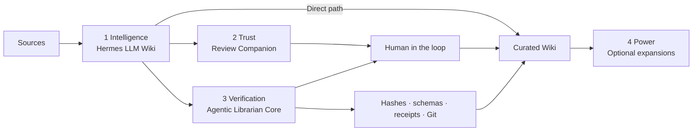

# LLM Wiki Review Companion — Start Here

> Adapted for this vault from the supplied `START HERE.md`, which is captured verbatim at
> `wiki/raw/articles/llm-wiki-review-companion-guide.md`. Changes: paths now point at this
> vault, every "Hermes may…" step is paired with the `tools/wiki_tool.py` command that
> enforces it, and the tooling and self-test sections are new. The upstream framing,
> warnings, and decision labels are unchanged.

Use this optional companion when you want the built-in LLM Wiki workflow to capture sources
normally but **stop for human approval** before creating or changing compiled Wiki pages.

The goal is anti-slopification: let AI organize knowledge without silently turning every
plausible synthesis into permanent truth. Raw evidence remains inspectable, the human
controls promotion, and the Wiki becomes a deliberately curated library of truth.

## How the four layers fit together



Each layer is a valid stopping point. The Companion does not replace the built-in skill's
intelligence, and the Core does not require the optional Power expansions.

**Where this vault sits:** layers 1–3. Intelligence is the unmodified upstream
`llm-wiki` skill; Trust is this companion plus `wiki/review/`; Verification is
`tools/wiki_tool.py` plus Git. Layer 4 is deliberately **not installed** — no Rail, memory
projection, automation, local models, or Molecular Zettelkasten.

## Choose the lightest workflow that fits

| Need | Use | What changes |
| --- | --- | --- |
| Fast personal synthesis and direct Wiki writes are acceptable | Built-in `llm-wiki` alone | The agent compiles Raw directly into Wiki |
| You want to approve material changes before they become trusted | Built-in `llm-wiki` **plus** `llm-wiki-review` | Markdown proposals wait for a human |
| You need automation, multiple agents, large queues, or mechanically enforced state | Agentic Librarian Core | Deterministic tools enforce paths, schemas, hashes, revisions, transactions, receipts, and recovery |
| You already have a stable Core and a specific additional need | Optional Power expansion | Add Rail, memory projection, automation, local models, or Molecular Zettelkasten separately |

Agentic memory and the Wiki also have different jobs. Memory can retain how you work,
preferences, and approved librarian lessons. The Wiki preserves source-traceable world
knowledge. A memory provider should not silently replace the human-approved Wiki.

> [!warning] Important limitation
> This skill is an instruction-based review convention, **not a deterministic security
> boundary**. Its reliability depends on the model following the skill. Keep Git or another
> backup enabled. Use the full Agentic Librarian when you require mechanically enforced
> hashes, stale-state checks, transactions, receipts, automation, or automatic Markdown
> processing.
>
> `tools/wiki_tool.py` closes part of that gap — hashes, schemas, path containment, revision
> binding, drift, and idempotency are enforced by code — but it cannot make an agent stop,
> because the agent can write the file without calling the tool. See
> `wiki/concepts/verification-layers.md` for the exact enforced-versus-requested table.

## Before you begin

- Enable the built-in `llm-wiki` skill (Hermes ships it; other runtimes can read the captured
  copy at `wiki/raw/articles/hermes-agent-llm-wiki-skill.md`).
- Install the `llm-wiki-review` folder from `skills/llm-wiki-review/` into the active
  profile's skills directory.
- Set `WIKI_PATH` to the vault, or provide the Wiki root when asked.
- Confirm the tooling runs: `python3 tools/wiki_tool.py lint` and `python3 tools/selftest.py`.
- Initialise Git in the vault. This is the only real backstop against an agent that does not
  stop.
- Do **not** run this companion and a full Agentic Librarian as simultaneous review authorities.
- Invoke this companion **first**. Running `/llm-wiki` directly can bypass its review gate.

## Start a reviewed Wiki run

Tell the agent:

```text
/llm-wiki-review Process <source path or URL> into my Wiki.
```

It may capture immutable Raw material, inspect existing Wiki pages, and create a Markdown
proposal in `wiki/review/`. It must stop before changing compiled Wiki content.

The mechanical equivalent, if you want the gate enforced rather than requested:

```bash
python3 tools/wiki_tool.py orient                                  # read schema + index + log first
python3 tools/wiki_tool.py capture --url <URL> --dest raw/articles/<name>.md
python3 tools/wiki_tool.py propose --target concepts/<name>.md --content /tmp/draft.md \
        --what "…" --evidence "…"
python3 tools/wiki_tool.py pending                                 # then STOP
```

## Review the proposal

For an ordinary change, choose `approve`, `reject`, `revise`, or `defer`.

For a possible contradiction, three primary choices are shown:

- **Keep both:** preserve both claims and mark the topic contested.
- **Not a contradiction:** create a new context-aware proposal without the contested marker,
  then ask again.
- **Decide later:** make no compiled change.

Preferring one source or requesting a custom resolution remains available as an advanced
revision and should include a reason or stronger evidence.

`wiki/review/2026-09-28-index-first-navigation-proposal.md` is a live example of the
contradiction flow, deliberately left `pending` so you can see the shape of the decision
before you have to make one.

## Continue

The easiest option is to reply with your choice. To work inside Obsidian, write the choice
under **Human feedback** or change the proposal's `decision` property, then say:

```text
Continue the pending Wiki review.
```

Or apply it yourself, deterministically:

```bash
python3 tools/wiki_tool.py apply 2026-09-28-<target>-proposal.md --decision approve --revision 1
```

Editing the note alone does not trigger the agent. **Silence and elapsed time are never
approval.**

## What the companion checks

Before applying an approval, it rereads the named proposal and revision, validates the
proposed schema, checks source traceability, looks for target drift, and confirms the target
remains inside the Wiki root. After an approved write, it asks the built-in skill to update
indexes and logs and run maintenance.

`wiki_tool.py apply` runs those checks in this order, and any failure exits non-zero with the
vault untouched:

1. Is there a decision at all, and is the proposal still in a decidable state?
2. Is this the revision the human reviewed?
3. Is the target inside the vault and inside a compiled directory?
4. Has the target drifted since review?
5. Do all cited raw captures still hash-verify?
6. Does the proposed content still validate against `SCHEMA.md`?
7. Is the proposed content byte-identical to what was reviewed?

Rejecting or deferring changes **only** the proposal state. If the target, source, schema,
path, or revision has changed, the tool stops instead of writing.

## Recovery

If a run stops unexpectedly, repeat the exact proposal path and revision and ask the agent to
recover the interrupted review. The companion is designed to inspect current state before
completing missing work or reporting that the operation is already finished.

The tool makes recovery mechanical: re-running `apply` on an already-applied proposal prints
`already applied` and produces a zero-byte delta with no duplicate log entry, so replaying a
half-finished operation is safe. Run `orient` after any interruption rather than resuming
from memory of what happened.

## Verifying the gate itself

```bash
python3 tools/selftest.py            # 95 cases; builds and destroys a throwaway vault
python3 tools/selftest.py -v         # echo every invocation and its output
python3 tools/selftest.py --keep /tmp/fixture   # inspect the fixture afterwards
```

The suite covers capture immutability, hash tamper detection, refusal to propose invalid
content, path escape, revision mismatch, target drift, raw source drift, post-review content
edits, reject/defer/revise semantics, approval idempotency, refusal to re-decide a settled
proposal, ambiguous queues, and index/log integrity.

Its scope note is the important part: passing it does **not** prove that a model stops when
told to, that a human read the proposal, or that a provenance marker's file supports the claim
it is attached to.

## When to use the full Librarian

Choose the full Agentic Librarian for unattended automation, multiple agents, large review
queues, browser Rail controls, memory projection, durable receipts, or deterministic
guarantees. The Review Companion is the lightweight human-in-the-loop option.

In one sentence: **the built-in skill supplies intelligence, the Companion adds human trust,
the tooling verifies the rules, and expansions add optional power.**
