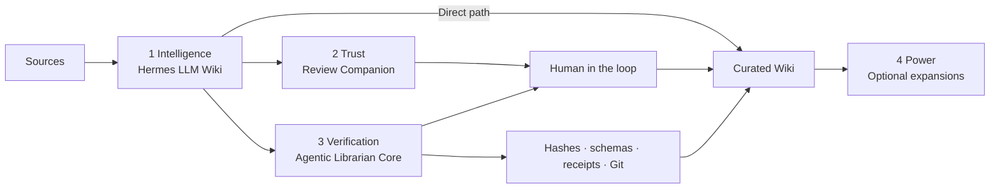

---
title: LLM Wiki Review Companion - Start Here
created: 2026-08-11
updated: 2026-08-11
type: guide
tags:
  - llm-wiki
  - hermes
  - review
---

# LLM Wiki Review Companion

Use this optional companion when you want Hermes' built-in LLM Wiki workflow to capture sources normally but stop for human approval before creating or changing compiled Wiki pages.

The goal is anti-slopification: let AI organize knowledge without silently
turning every plausible synthesis into permanent truth. Raw evidence remains
inspectable, the human controls promotion, and the Wiki becomes a deliberately
curated library of truth.

## How the four layers fit together



Each layer is a valid stopping point. The Companion does not replace Hermes'
intelligence, and the Core does not require the optional Power expansions.

## Choose the lightest workflow that fits

| Need | Use | What changes |
| --- | --- | --- |
| Fast personal synthesis and direct Wiki writes are acceptable | Hermes' built-in `llm-wiki` | The agent compiles Raw directly into Wiki |
| You want to approve material changes before they become trusted | Built-in `llm-wiki` plus `llm-wiki-review` | Markdown proposals wait for a human |
| You need automation, multiple agents, large queues, or mechanically enforced state | Agentic Librarian Core | Deterministic tools enforce paths, schemas, hashes, revisions, transactions, receipts, and recovery |
| You already have a stable Core and a specific additional need | Optional Power expansion | Add Rail, memory projection, automation, local models, or Molecular Zettelkasten separately |

Agentic memory and the Wiki also have different jobs. Memory can retain how you
work, preferences, and approved librarian lessons. The Wiki preserves
source-traceable world knowledge. A memory provider should not silently replace
the human-approved Wiki.

> [!warning] Important limitation
> This skill is an instruction-based review convention, not a deterministic security boundary. Its reliability depends on the model following the skill. Keep Git or another backup enabled. Use the full Agentic Librarian when you require mechanically enforced hashes, stale-state checks, transactions, receipts, automation, or automatic Markdown processing.

## Before you begin

- Enable Hermes' built-in `llm-wiki` skill.
- Install the `llm-wiki-review` folder in the active Hermes profile's skills directory.
- Set `WIKI_PATH`, or provide the Wiki root when asked.
- Do not run this companion and the full Agentic Librarian as simultaneous review authorities.
- Invoke this companion first. Running `/llm-wiki` directly can bypass its review gate.

## Start a reviewed Wiki run

Tell Hermes:

```text
/llm-wiki-review Process <source path or URL> into my Wiki.
```

Hermes may capture immutable Raw material, inspect existing Wiki pages, and create a Markdown proposal in `Review/`. It must stop before changing compiled Wiki content.

## Review the proposal

For an ordinary change, choose `approve`, `reject`, `revise`, or `defer`.

For a possible contradiction, Hermes shows three primary choices:

- **Keep both:** preserve both claims and mark the topic contested.
- **Not a contradiction:** create a new context-aware proposal without the contested marker, then ask again.
- **Decide later:** make no compiled change.

Preferring one source or requesting a custom resolution remains available as an advanced revision and should include a reason or stronger evidence.

## Continue

The easiest option is to reply to Hermes with your choice. To work inside Obsidian, write the choice under **Human feedback** or change the proposal's `decision` property, then tell Hermes:

```text
Continue the pending Wiki review.
```

Editing the note alone does not trigger the agent. Silence and elapsed time are never approval.

## What the companion checks

Before applying an approval, it rereads the named proposal and revision, validates the proposed schema, checks source traceability, looks for target drift, and confirms the target remains inside the Wiki root. After an approved write, it asks the built-in skill to update indexes and logs and run maintenance.

Rejecting or deferring should change only the proposal state. If the target, source, schema, path, or revision has changed, Hermes should stop or create a new pending revision.

## Recovery

If a run stops unexpectedly, repeat the exact proposal path and revision and ask Hermes to recover the interrupted review. The companion is designed to inspect current state before completing missing work or reporting that the operation is already finished.

## When to use the full Librarian

Choose the full Agentic Librarian for unattended automation, multiple agents, large review queues, browser Rail controls, memory projection, durable receipts, or deterministic guarantees. The Review Companion is the lightweight human-in-the-loop option.

In one sentence: **Hermes supplies intelligence, the Companion adds human
trust, the Core verifies the rules, and expansions add optional power.**
